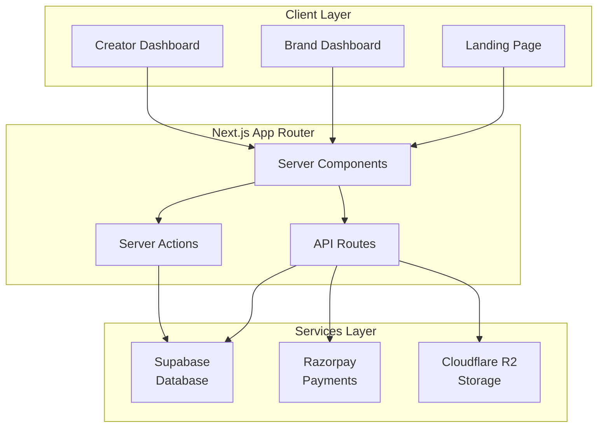
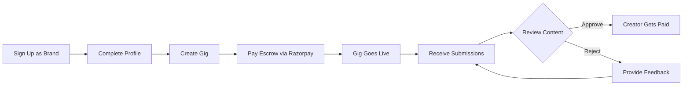
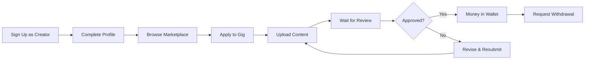
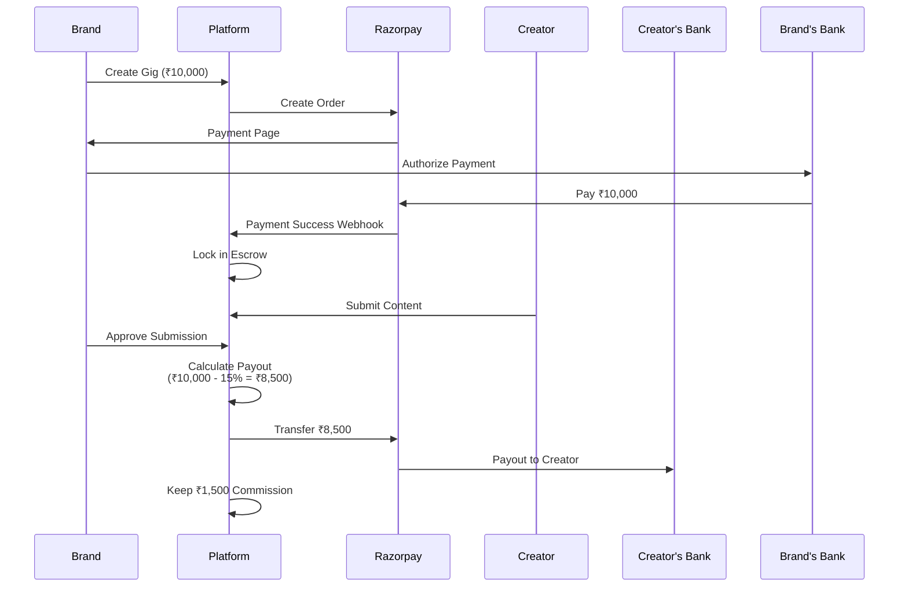

<div align="center">

# 🎨 UGCHub - UGC Marketplace Platform

### *Empowering Creators. Amplifying Brands.*

[](https://nextjs.org/)
[](https://developer.mozilla.org/en-US/docs/Web/JavaScript)
[](https://tailwindcss.com/)
[](https://supabase.com/)
[](https://razorpay.com/)

A production-ready, full-stack UGC (User Generated Content) marketplace where **Brands** post content creation gigs and **Creators** earn money by completing them. Built with modern web technologies and designed for the Indian market with global scalability.

[🚀 Live Demo](#) • [📖 Documentation](#) • [🐛 Report Bug](https://github.com/yourusername/ugchub/issues) • [✨ Request Feature](https://github.com/yourusername/ugchub/issues)

</div>

---

## 📑 Table of Contents

- [🌟 Overview](#-overview)
- [✨ Key Features](#-key-features)
- [🛠 Tech Stack](#-tech-stack)
- [🏗 Architecture](#-architecture)
- [🔄 How It Works](#-how-it-works)
- [🗄 Database Schema](#-database-schema)
- [💳 Payment Flow](#-payment-flow)
- [🚀 Getting Started](#-getting-started)
- [📁 Project Structure](#-project-structure)
- [🔐 Environment Variables](#-environment-variables)
- [🌐 Deployment](#-deployment)
- [🔮 Roadmap](#-roadmap)
- [🤝 Contributing](#-contributing)
- [📄 License](#-license)

---

## 🌟 Overview

UGCHub is a **two-sided marketplace** that connects brands seeking authentic user-generated content with talented creators looking to monetize their skills. The platform implements a secure **escrow payment system**, ensuring trust and transparency for both parties.

### 🎯 Problem Statement

- 🔍 Brands struggle to find authentic, relatable content creators at scale
- 💼 Creators lack a centralized platform to discover paid opportunities
- 💸 Traditional influencer marketing is expensive and lacks quality control

### 💡 Solution

UGCHub provides:

✅ **Gig-based marketplace** where brands post detailed content briefs  
✅ **Escrow payment system** that protects both parties  
✅ **Review and approval workflow** ensuring quality control  
✅ **Portfolio building** for creators to showcase their work


---

## ✨ Key Features

<table>
<tr>
<td width="50%">

### For Brands 🏢

- ✅ **Create Detailed Gigs** - Rich text editor, reference materials, budget allocation
- ✅ **Review Submissions** - Approve/reject content with feedback
- ✅ **Escrow Protection** - Funds held securely until work is approved
- ✅ **Analytics Dashboard** - Track spending, active campaigns, and ROI
- ✅ **Quality Control** - Multi-stage review process

</td>
<td width="50%">

### For Creators 🎨

- ✅ **Browse Marketplace** - Filter by budget, category, deadline
- ✅ **Apply to Gigs** - Submit proposals and upload content
- ✅ **Earn Money** - Transparent payment system with instant wallet updates
- ✅ **Build Portfolio** - Showcase approved work to attract more gigs
- ✅ **Track Earnings** - Detailed transaction history and payout management

</td>
</tr>
</table>

### Platform Features 🚀

<div align="center">

| Feature | Description |
|:---|:---|
| 🔐 **Dual Authentication** | Separate flows for Brands and Creators |
| 🛡️ **Role-Based Access Control** | Secure, role-specific dashboards |
| 📁 **File Storage** | Cloudflare R2 for scalable media uploads |
| 💳 **Payment Integration** | Razorpay (India) with Stripe ready for global expansion |
| 📱 **Responsive Design** | Mobile-first, premium dark mode UI |
| ⚡ **Real-time Updates** | Instant notifications for gig status changes |

</div>

---

## 🛠 Tech Stack

<div align="center">

### Frontend


### Backend


### Payments & Storage


### DevOps


</div>

<details>
<summary><b>📦 Detailed Tech Stack</b></summary>

### Frontend Technologies

| Technology | Purpose | Why? |
|:---|:---|:---|
| **Next.js 14+** | React Framework | Server Components, App Router, API Routes |
| **JavaScript (ES6+)** | Programming Language | Modern syntax, flexible, industry standard |
| **Tailwind CSS** | Styling | Utility-first, rapid development |
| **shadcn/ui** | Component Library | Accessible, customizable components |
| **Framer Motion** | Animations | Smooth micro-interactions |
| **React Hook Form** | Form Management | Performance, validation |
| **Zod** | Schema Validation | Runtime type checking and validation |
| **Lucide React** | Icons | Modern, consistent iconography |

### Backend Technologies

| Technology | Purpose | Why? |
|:---|:---|:---|
| **Next.js API Routes** | Backend API | Serverless, same codebase |
| **Supabase** | Database (PostgreSQL) | Real-time, RLS, generous free tier |
| **NextAuth.js v5** | Authentication | OAuth, credentials, session management |
| **Razorpay SDK** | Payment Processing | India-first, test mode support |
| **Cloudflare R2** | File Storage | S3-compatible, cost-effective |
| **Resend** | Transactional Emails | Modern email API |

### DevOps & Deployment

| Technology | Purpose |
|:---|:---|
| **Vercel** | Hosting & CI/CD |
| **GitHub Actions** | Automated testing |
| **Vercel Analytics** | Performance monitoring |

</details>

---

## 🏗 Architecture

<div align="center">

### System Architecture



</div>

### 📂 Component Architecture

```
app/
├── (auth)/              # 🔐 Authentication routes
│   ├── login/
│   ├── signup/
│   └── onboarding/
├── dashboard/
│   ├── brand/           # 🏢 Brand-specific pages
│   └── creator/         # 🎨 Creator-specific pages
├── marketplace/         # 🛍️ Public gig marketplace
├── api/                 # ⚡ API routes
│   ├── gigs/
│   ├── submissions/
│   ├── payments/
│   └── upload/
└── page.tsx             # 🏠 Landing page
```

---

## 🔄 How It Works

<div align="center">

### Brand Journey



### Creator Journey



</div>

---

## 🗄 Database Schema

<details>
<summary><b>📊 View Complete Schema</b></summary>

### Core Tables

#### 👤 users
*Managed by NextAuth.js*

```sql
- id (uuid, PK)
- email (unique)
- name
- role (enum: 'brand' | 'creator')
- avatar_url
- created_at
```

#### 🏢 brand_profiles

```sql
- id (uuid, PK)
- user_id (FK → users.id)
- company_name
- industry
- website
- verified (boolean)
```

#### 🎨 creator_profiles

```sql
- id (uuid, PK)
- user_id (FK → users.id)
- bio
- portfolio_url
- social_handles (jsonb)
- niches (text[])
- rating (decimal)
- total_earnings (decimal)
```

#### 📋 gigs

```sql
- id (uuid, PK)
- brand_id (FK → users.id)
- title
- description (rich text)
- content_type (enum: 'reel' | 'story' | 'post' | 'video')
- budget (decimal)
- deadline (timestamp)
- slots_available (integer)
- requirements (jsonb)
- reference_files (text[])
- status (enum: 'open' | 'in_progress' | 'completed' | 'cancelled')
- created_at
```

#### 📤 submissions

```sql
- id (uuid, PK)
- gig_id (FK → gigs.id)
- creator_id (FK → users.id)
- file_url
- thumbnail_url
- status (enum: 'pending' | 'approved' | 'rejected')
- feedback (text)
- submitted_at
- reviewed_at
```

#### 💰 transactions

```sql
- id (uuid, PK)
- gig_id (FK)
- brand_id (FK)
- creator_id (FK, nullable)
- amount (decimal)
- type (enum: 'escrow_deposit' | 'payout' | 'refund')
- status (enum: 'pending' | 'completed' | 'failed')
- razorpay_order_id
- razorpay_payment_id
- created_at
```

### 🔗 Relationships

- One Brand → Many Gigs
- One Gig → Many Submissions
- One Creator → Many Submissions
- One Gig → One Escrow Transaction → Many Payout Transactions

</details>

---

## 💳 Payment Flow

<div align="center">

### Escrow System



</div>

### 💸 Payment States

| State | Description | Amount |
|:---|:---|:---:|
| **Escrow Deposit** | Brand pays full amount upfront | 100% |
| **Locked** | Funds held by platform until approval | 100% |
| **Payout** | Released to creator on approval | 85% |
| **Commission** | Retained by platform | 15% |
| **Refund** | Full refund if gig cancelled before submission | 100% |

---

## 🚀 Getting Started

### Prerequisites

-  and npm
-  account (free tier)
-  test account
-  account (for R2 storage)

### Installation

1️⃣ **Clone the repository**

```bash
git clone https://github.com/yourusername/ugchub.git
cd ugchub
```

2️⃣ **Install dependencies**

```bash
npm install
```

3️⃣ **Set up environment variables**

```bash
cp .env.example .env.local
# Fill in your credentials (see Environment Variables section)
```

4️⃣ **Set up Supabase database**

```bash
# Run migrations
npm run db:migrate

# Seed sample data (optional)
npm run db:seed
```

5️⃣ **Run development server**

```bash
npm run dev
```

6️⃣ **Open your browser**

```
🎉 http://localhost:3000
```

---

## 📁 Project Structure

<details>
<summary><b>🗂️ View Full Structure</b></summary>

```
ugchub/
├── 📱 app/                          # Next.js App Router
│   ├── 🔐 (auth)/                   # Auth routes (grouped)
│   │   ├── login/
│   │   ├── signup/
│   │   └── onboarding/
│   ├── 📊 dashboard/
│   │   ├── brand/
│   │   │   ├── page.js              # Brand dashboard
│   │   │   └── gigs/
│   │   │       ├── new/             # Create gig
│   │   │       └── [id]/            # Gig details
│   │   └── creator/
│   │       ├── page.js              # Creator dashboard
│   │       ├── earnings/
│   │       └── portfolio/
│   ├── 🛍️ marketplace/
│   │   ├── page.js                  # Gig marketplace
│   │   └── [id]/                    # Gig detail page
│   ├── ⚡ api/
│   │   ├── auth/[...nextauth]/      # NextAuth config
│   │   ├── gigs/
│   │   ├── submissions/
│   │   ├── payments/
│   │   └── upload/
│   ├── layout.js                    # Root layout
│   └── page.js                      # Landing page
├── 🎨 components/
│   ├── ui/                          # shadcn components
│   ├── gig-card.jsx
│   ├── submission-card.jsx
│   ├── stats-card.jsx
│   ├── navbar.jsx
│   └── file-upload.jsx
├── 📚 lib/
│   ├── supabase.js                  # Supabase client
│   ├── razorpay.js                  # Razorpay utilities
│   ├── r2.js                        # Cloudflare R2 client
│   └── validations.js               # Zod schemas
├── 📝 types/
│   └── index.js                     # JavaScript types/constants
├── 🖼️ public/                       # Static assets
├── middleware.js                    # Auth middleware
├── tailwind.config.js
├── next.config.js
└── package.json
```

</details>

---

## 🔐 Environment Variables

Create a `.env.local` file in the root directory:

```bash
# 🗄️ Database
NEXT_PUBLIC_SUPABASE_URL=your_supabase_url
NEXT_PUBLIC_SUPABASE_ANON_KEY=your_supabase_anon_key
SUPABASE_SERVICE_ROLE_KEY=your_service_role_key

# 🔐 Authentication
NEXTAUTH_URL=http://localhost:3000
NEXTAUTH_SECRET=your_nextauth_secret
GOOGLE_CLIENT_ID=your_google_client_id
GOOGLE_CLIENT_SECRET=your_google_client_secret

# 💳 Payments
RAZORPAY_KEY_ID=your_razorpay_key_id
RAZORPAY_KEY_SECRET=your_razorpay_key_secret
NEXT_PUBLIC_RAZORPAY_KEY_ID=your_razorpay_key_id

# 📁 File Storage
R2_ACCOUNT_ID=your_cloudflare_account_id
R2_ACCESS_KEY_ID=your_r2_access_key
R2_SECRET_ACCESS_KEY=your_r2_secret_key
R2_BUCKET_NAME=ugchub-uploads

# 📧 Email
RESEND_API_KEY=your_resend_api_key
```

<details>
<summary><b>🔑 How to Get API Keys</b></summary>

### Supabase
1. Go to [supabase.com](https://supabase.com)
2. Create a new project
3. Go to Settings → API
4. Copy `URL` and `anon public` key

### Razorpay
1. Sign up at [razorpay.com](https://razorpay.com)
2. Go to Settings → API Keys
3. Generate Test Keys
4. Copy Key ID and Secret

### Cloudflare R2
1. Go to [Cloudflare Dashboard](https://dash.cloudflare.com)
2. Navigate to R2
3. Create a new bucket
4. Generate API tokens

</details>

---

## 🌐 Deployment

### Deploy to Vercel (Recommended)

[](https://vercel.com/new/clone?repository-url=https://github.com/yourusername/ugchub)

**Manual Deployment:**

1️⃣ **Push to GitHub**

```bash
git add .
git commit -m "Initial commit"
git push origin main
```

2️⃣ **Import to Vercel**

- Go to [vercel.com](https://vercel.com)
- Click "Import Project"
- Select your repository
- Add environment variables
- Deploy! 🚀

3️⃣ **Set up webhooks**

- Add Razorpay webhook URL: `https://yourdomain.com/api/payments/webhook`
- Configure Supabase webhooks for real-time updates

4️⃣ **Database Migrations**

```bash
# Production migration
npm run db:migrate:prod
```

---

## 🔮 Roadmap

### 🎯 Phase 2 - Enhanced Features (Q2 2025)

- [ ] 🤖 **AI-Powered Recommendations** - Suggest gigs to creators based on past work
- [ ] ⭐ **Creator Ratings & Reviews** - 5-star rating system with verified reviews
- [ ] ✅ **Brand Verification** - Blue tick for verified brands
- [ ] 🔍 **Advanced Filters** - Filter by creator tier, completion rate, response time
- [ ] 💬 **In-App Messaging** - Direct chat between brands and creators
- [ ] 🔄 **Revision Requests** - Structured feedback loop for content revisions
- [ ] 📧 **Notification System** - Email + Push notifications for gig updates
- [ ] 📊 **Enhanced Analytics** - ROI tracking, content performance metrics
- [ ] 📚 **Content Library** - Brands can save approved content
- [ ] 📄 **Bulk Gig Creation** - Upload CSV to create multiple gigs

### 🌍 Phase 3 - Global Expansion (Q3 2025)

- [ ] 💱 **Multi-Currency Support** - USD, EUR, GBP alongside INR
- [ ] 💳 **Stripe Integration** - International payment processing
- [ ] 🌐 **Localization** - Multi-language support (Hindi, Spanish, etc.)
- [ ] 🤖 **AI Content Moderation** - Auto-flag inappropriate submissions
- [ ] 💰 **Smart Pricing** - AI-suggested gig pricing based on market rates
- [ ] 🎯 **Auto-Matching** - Automatically match creators to relevant gigs

### 🏆 Phase 4 - Gamification & Mobile (Q4 2025)

- [ ] 🥇 **Creator Levels** - Bronze → Silver → Gold → Platinum tiers
- [ ] 🏅 **Badges & Achievements** - "Fast Responder", "Top Rated", etc.
- [ ] 📱 **React Native App** - iOS + Android native apps
- [ ] 🔔 **Push Notifications** - Real-time gig alerts
- [ ] 👥 **Referral Program** - Earn bonuses for referring creators/brands
- [ ] 🔒 **KYC Verification** - Aadhaar/PAN verification for Indian users

<div align="center">

### 📊 Development Progress


</div>

---

## 🤝 Contributing

Contributions are welcome! Please follow these steps:

1. 🍴 Fork the repository
2. 🌿 Create a feature branch (`git checkout -b feature/AmazingFeature`)
3. 💾 Commit your changes (`git commit -m 'Add some AmazingFeature'`)
4. 📤 Push to the branch (`git push origin feature/AmazingFeature`)
5. 🔀 Open a Pull Request

### Development Guidelines

- ✅ Follow the existing code style (Prettier + ESLint)
- ✅ Write meaningful commit messages
- ✅ Add tests for new features
- ✅ Update documentation as needed


---

## 📄 License

This project is licensed under the **MIT License** - see the [LICENSE](LICENSE) file for details.

---

## 🙏 Acknowledgments

- [Next.js](https://nextjs.org/) - The React Framework
- [shadcn/ui](https://ui.shadcn.com/) - Beautiful component library
- [Supabase](https://supabase.com/) - Open-source Firebase alternative
- [Razorpay](https://razorpay.com/) - Payment gateway for India
- [Vercel](https://vercel.com/) - Deployment platform

---

## 📧 Contact

<div align="center">

**Project Maintainer:** [Your Name]

[](https://github.com/yourusername)
[](https://linkedin.com/in/yourprofile)
[](mailto:your.email@example.com)

</div>

---

<div align="center">

### 💖 Built with Love for the Creator Economy

If you found this project helpful, please consider giving it a ⭐!

**[⬆ Back to Top](#-ugchub---ugc-marketplace-platform)**

</div>
